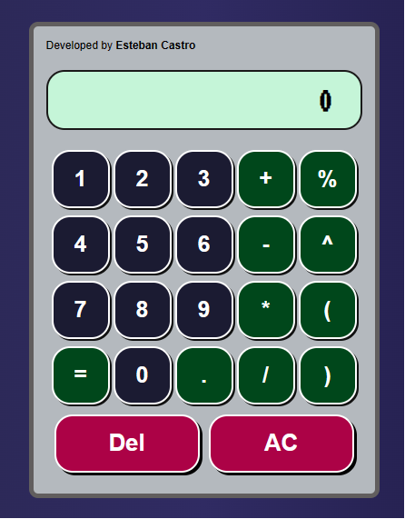

# Calculadora Interactiva en React con math.js

Aplicación desarrollada con React como parte del curso de freeCodeCamp. Una calculadora interactiva que realiza las cuatro operaciones aritméticas básicas (suma, resta, multiplicación y división). Adicionalmente, se mejoró agregandole porcentaje, potencia, y finalmente, paréntesis, para concatenar operaciones más complejas y que puedan ser evaluadas correctamente por la librería math.js. Este ejercicio es ideal para practicar lógica en React y el Hook useState.

## Características

[Click para ver la versión en vivo del proyecto](https://codepen.io/ecastroc/full/VwVQJja)

